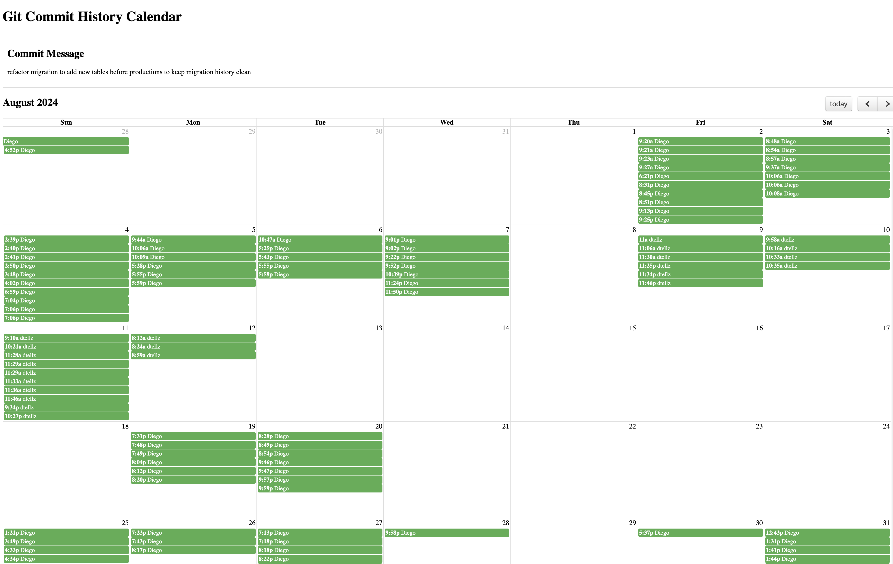

# Git Commit History Calendar

This script generates an HTML file displaying your Git commit history in a calendar format. The generated HTML includes the commit date, author name, and commit message, which are visualized on an interactive calendar.

<p align="center" margin="0">
    <a href="https://www.diego-tellez.com/">
    
</a>
</p>

## Prerequisites

- **Git**: The script uses the `git log` command to retrieve the commit history. Make sure Git is installed and the script is run inside a Git repository.
- **Bash**: This is a Bash script, so you need a Bash-compatible environment (Linux or macOS).

## Installation

1. Clone the repository or download the script.
2. Copy the script to the root of your repository.
3. Make sure the script has execution permissions. You can set the permission using:

    ```bash
    chmod +x generate_git_calendar.sh
    ```

## Usage

1. Run the script from the terminal at the root of the repo:

    ```bash
    ./generate_git_calendar.sh
    ```

2. The script will generate an HTML file named `git_commit_calendar.html` in the current directory.
3. The script will automatically open the HTML file in your default web browser based on the operating system:
    - **macOS**: It will use the `open` command.
    - **Linux**: It will use the `xdg-open` command.
4. If the script fails to detect the OS or you're using an unsupported OS, you will need to manually open the file by navigating to the directory and opening `git_commit_calendar.html` on your preferred browser.

## Example Output

The calendar will display the commit author as the title of each event on the calendar. When you click on a specific commit event, a section will show the corresponding commit message on top of the calendar.

## Script Breakdown

- The script fetches the commit history using `git log` with the format `date | author | message`.
- The data is then formatted into an interactive calendar using FullCalendar (a jQuery plugin) and displayed in the HTML.
- Clicking on any event in the calendar will display the commit message below the calendar.

## Requirements

- Git installed on your machine.
- Internet access is required to load external CSS and JavaScript libraries used in the HTML file.

## Troubleshooting

- Ensure you are running the script inside a Git repository, or it will not be able to retrieve the commit history.
- If the HTML file does not open automatically, manually open the file by navigating to it in your file explorer or using the `open` or `xdg-open` command.
- For any unsupported operating systems, open the generated HTML file manually in a browser.

## License

This project is open-source and available under the MIT License.
